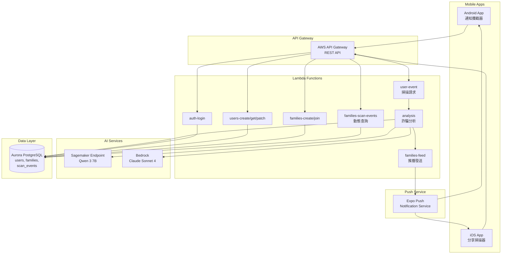
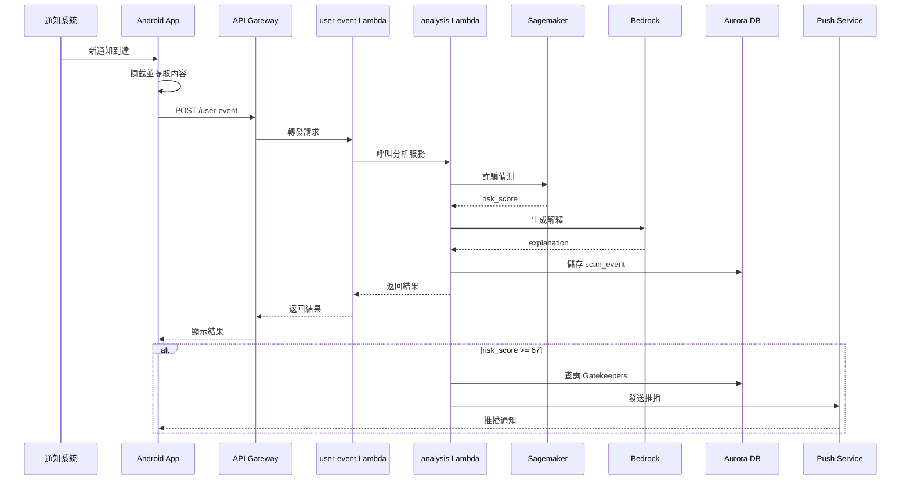
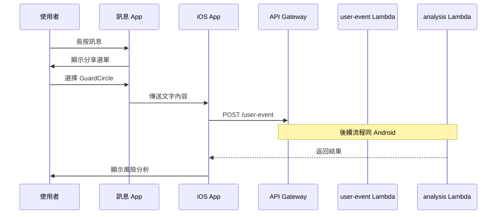
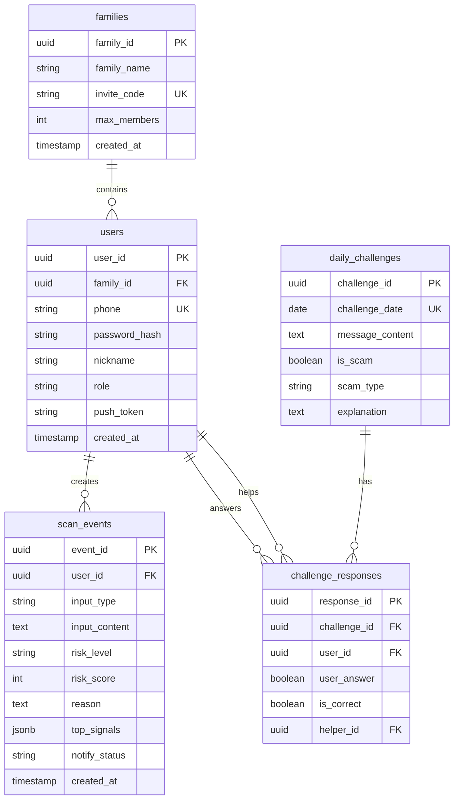

# Design Document: GuardCircle 防詐騙系統

## Overview

GuardCircle 是一套針對長輩設計的防詐騙系統，結合自動攔截、AI 偵測與家庭聯防三大核心能力。系統透過 Android 通知攔截器與 iOS 分享掃描器涵蓋所有主流訊息管道，使用 Amazon Sagemaker 訓練的機器學習模型進行詐騙偵測，並透過 Amazon Bedrock 生成白話文解釋，讓長輩能真正理解風險。採用三角色設計（Elder、Gatekeeper、Solver），讓子女能遠端確認並介入，打破孤島式防護。

### 設計目標

1. **零學習成本**：Android 自動攔截，長輩無需手動操作
2. **可解釋性**：白話文說明判斷理由，建立信任
3. **家庭聯防**：高風險訊息即時推播給守門人，遠端介入保護
4. **教育導向**：每日挑戰題目提升防詐騙意識
5. **跨平台支援**：Android 與 iOS 雙平台覆蓋

### 技術棧

- **前端**：React Native (Expo) - 跨平台行動應用程式
- **後端**：Go + AWS Lambda - 無伺服器微服務架構
- **資料庫**：Amazon Aurora PostgreSQL - 關聯式資料庫
- **AI 模型**：Amazon Sagemaker (Qwen 3 7B 微調) - 詐騙偵測
- **解釋生成**：Amazon Bedrock (Claude Sonnet 4) - 白話文解釋
- **基礎設施**：Terraform - 基礎設施即程式碼
- **推播通知**：Expo Push Notifications - 跨平台推播

## Architecture

### 系統架構圖



### 架構設計原則

1. **無伺服器優先**：使用 AWS Lambda 實現按需擴展，降低運營成本
2. **微服務分離**：每個 Lambda 函數負責單一職責，便於維護和擴展
3. **非同步處理**：詐騙分析與推播發送採用非同步架構，提升回應速度
4. **資料隔離**：使用 family_id 確保資料隔離，保護隱私
5. **容錯設計**：AI 服務失敗時提供降級方案，確保系統可用性

### 資料流程

#### 1. Android 自動掃描流程



#### 2. iOS 分享掃描流程



## Components and Interfaces

### 前端組件

#### 1. Android 通知攔截器 (Notification Interceptor)

**職責**：監聽並攔截 Android 系統通知，自動提取內容進行掃描

**技術實現**：
- 使用 `NotificationListenerService` 監聽通知
- 透過 React Native Native Module 橋接
- 背景服務持續運行

**關鍵方法**：
```typescript
interface NotificationInterceptor {
  // 請求通知存取權限
  requestPermission(): Promise<boolean>;
  
  // 開始監聽通知
  startListening(): void;
  
  // 停止監聽
  stopListening(): void;
  
  // 提取通知內容
  extractNotification(notification: Notification): {
    title: string;
    content: string;
    packageName: string;
    timestamp: number;
  };
}
```

#### 2. iOS 分享掃描器 (Share Scanner)

**職責**：透過 iOS 分享擴充功能接收文字內容

**技術實現**：
- 使用 Expo Sharing API
- 註冊為系統分享目標
- 接收文字類型分享

**關鍵方法**：
```typescript
interface ShareScanner {
  // 註冊分享處理器
  registerShareHandler(handler: (text: string) => void): void;
  
  // 處理分享內容
  handleShare(sharedContent: string): Promise<ScanResult>;
}
```

#### 3. 掃描結果顯示組件

**職責**：視覺化呈現風險分析結果

**UI 元素**：
- 風險等級徽章（低/中/高，對應綠/黃/紅）
- 風險分數圓形進度條
- 白話文解釋卡片
- 原始訊息內容
- 分享給守門人按鈕

### 後端服務

#### 1. auth-login Lambda

**職責**：處理使用者登入驗證

**API Endpoint**：`POST /auth/login`

**請求格式**：
```json
{
  "phone": "0912345678",
  "password": "password123"
}
```

**回應格式**：
```json
{
  "token": "eyJhbGciOiJIUzI1NiIsInR5cCI6IkpXVCJ9...",
  "user": {
    "user_id": "uuid",
    "nickname": "王小明",
    "role": "guardian"
  }
}
```

#### 2. users-create Lambda

**職責**：創建新使用者帳號

**API Endpoint**：`POST /users`

**請求格式**：
```json
{
  "phone": "0912345678",
  "password": "password123",
  "nickname": "王小明",
  "role": "guardian",
  "gender": "male",
  "birthday": "1950-01-01",
  "contact_phone": "0912345678"
}
```

#### 3. families-create Lambda

**職責**：創建新家庭圈並生成邀請碼

**API Endpoint**：`POST /families`

**請求格式**：
```json
{
  "family_name": "王家守護圈"
}
```

**回應格式**：
```json
{
  "family_id": "uuid",
  "family_name": "王家守護圈",
  "invite_code": "ABC123XYZ",
  "created_at": "2025-01-15T10:30:00Z"
}
```

#### 4. families-join Lambda

**職責**：使用邀請碼加入家庭圈

**API Endpoint**：`POST /families/join`

**請求格式**：
```json
{
  "invite_code": "ABC123XYZ"
}
```

#### 5. user-event Lambda

**職責**：接收掃描請求並協調分析流程

**API Endpoint**：`POST /user-event`

**請求格式**：
```json
{
  "input_type": "text",
  "input_content": "恭喜您中獎了！請點擊連結領取獎金..."
}
```

**回應格式**：
```json
{
  "event_id": "uuid",
  "risk_level": "high",
  "risk_score": 85,
  "reason": "此訊息包含多個詐騙特徵：1. 聲稱中獎但您未參加任何活動 2. 要求點擊不明連結 3. 製造緊迫感...",
  "top_signals": [
    {"signal": "fake_prize", "confidence": 0.92},
    {"signal": "phishing_url", "confidence": 0.88}
  ],
  "created_at": "2025-01-15T10:30:00Z"
}
```

#### 6. analysis Lambda

**職責**：核心詐騙分析服務，整合 Sagemaker 與 Bedrock

**內部服務**（不直接暴露 API）

**處理流程**：
1. 接收訊息內容
2. 呼叫 Sagemaker Endpoint 進行詐騙偵測
3. 取得 risk_score 和 top_signals
4. 呼叫 Bedrock 生成白話文解釋
5. 儲存 scan_event 到資料庫
6. 若為高風險，觸發推播服務
7. 返回完整分析結果

**Sagemaker 整合**：
```go
type SagemakerRequest struct {
    Text string `json:"text"`
}

type SagemakerResponse struct {
    RiskScore  int                    `json:"risk_score"`
    TopSignals []map[string]interface{} `json:"top_signals"`
}
```

**Bedrock 整合**：
```go
type BedrockRequest struct {
    ModelId string `json:"modelId"`
    Messages []Message `json:"messages"`
}

type Message struct {
    Role    string `json:"role"`
    Content string `json:"content"`
}
```

#### 7. families-scan-events Lambda

**職責**：查詢家庭圈掃描記錄

**API Endpoint**：`GET /families/{family_id}/scan-events`

**查詢參數**：
- `limit`: 每頁筆數（預設 20，最大 50）
- `offset`: 分頁偏移量
- `risk_level`: 篩選風險等級（low/medium/high）

**回應格式**：
```json
{
  "events": [
    {
      "event_id": "uuid",
      "user": {
        "user_id": "uuid",
        "nickname": "王小明"
      },
      "input_type": "text",
      "input_content": "訊息內容...",
      "risk_level": "high",
      "risk_score": 85,
      "reason": "判斷理由...",
      "created_at": "2025-01-15T10:30:00Z"
    }
  ],
  "total": 150,
  "has_more": true
}
```

#### 8. families-feed Lambda

**職責**：發送推播通知給守門人

**內部服務**（由 analysis Lambda 觸發）

**處理流程**：
1. 接收高風險 scan_event
2. 查詢家庭圈所有 Gatekeeper
3. 取得 Gatekeeper 的推播 token
4. 呼叫 Expo Push Notification API
5. 更新 scan_event 的 notify_status

**推播內容格式**：
```json
{
  "to": ["ExponentPushToken[xxx]"],
  "title": "⚠️ 高風險訊息警報",
  "body": "王小明 掃描到高風險訊息：恭喜您中獎了！請點擊連結...",
  "data": {
    "event_id": "uuid",
    "risk_level": "high"
  },
  "sound": "default",
  "priority": "high"
}
```

### AI 服務組件

#### 1. Scam Detector (Sagemaker)

**模型**：Qwen 3 7B (微調版本)

**訓練資料**：
- Stage 1: 公開英文詐騙資料集（Kaggle + HuggingFace）
- Stage 2: 台灣繁體中文詐騙資料集 + Bedrock Sonnet 生成的判斷理由

**輸入格式**：
```json
{
  "text": "訊息內容"
}
```

**輸出格式**：
```json
{
  "risk_score": 85,
  "top_signals": [
    {"signal": "fake_prize", "confidence": 0.92},
    {"signal": "phishing_url", "confidence": 0.88},
    {"signal": "urgency_manipulation", "confidence": 0.85}
  ]
}
```

**詐騙信號類型**：
- `fake_prize`: 假中獎
- `phishing_url`: 釣魚連結
- `urgency_manipulation`: 製造緊迫感
- `impersonation`: 假冒官方
- `money_request`: 要求匯款
- `personal_info_request`: 索取個人資訊
- `investment_scam`: 投資詐騙
- `loan_scam`: 貸款詐騙

#### 2. Explanation Generator (Bedrock)

**模型**：Claude Sonnet 4

**系統提示詞**：
```
你是一個專業的詐騙偵測助手。你的任務是用白話文向長輩解釋為什麼這則訊息可能是詐騙。

要求：
1. 使用繁體中文
2. 語氣溫和、易懂
3. 不超過 200 字
4. 列出 2-3 個具體的可疑特徵
5. 避免使用專業術語
```

**輸入格式**：
```json
{
  "message_content": "訊息內容",
  "risk_score": 85,
  "top_signals": [...]
}
```

**輸出範例**：
```
此訊息包含多個詐騙特徵：

1. 聲稱中獎但您未參加任何活動
2. 要求點擊不明連結，可能竊取個人資料
3. 製造緊迫感，要求立即行動

建議：不要點擊連結，直接刪除此訊息。如有疑問，請詢問家人或撥打 165 反詐騙專線。
```

## Data Models

### 資料庫 Schema

#### 1. users 表

```sql
CREATE TABLE users (
    user_id UUID PRIMARY KEY DEFAULT gen_random_uuid(),
    family_id UUID REFERENCES families(family_id) ON DELETE SET NULL,
    phone VARCHAR(20) NOT NULL UNIQUE,
    password_hash VARCHAR(255) NOT NULL,
    nickname VARCHAR(100) NOT NULL,
    gender VARCHAR(10) CHECK (gender IN ('male', 'female', 'other', 'unknown')),
    birthday DATE,
    role VARCHAR(20) NOT NULL DEFAULT 'youth'
        CHECK (role IN ('guardian', 'gatekeeper', 'youth')),
    contact_phone VARCHAR(20) NOT NULL,
    push_token VARCHAR(255),  -- Expo Push Token
    created_at TIMESTAMP NOT NULL DEFAULT CURRENT_TIMESTAMP,
    updated_at TIMESTAMP NOT NULL DEFAULT CURRENT_TIMESTAMP
);

CREATE INDEX idx_users_phone ON users(phone);
CREATE INDEX idx_users_family_id ON users(family_id);
```

**欄位說明**：
- `user_id`: 使用者唯一識別碼
- `family_id`: 所屬家庭圈 ID（可為 NULL）
- `phone`: 手機號碼（登入帳號）
- `password_hash`: bcrypt 雜湊密碼
- `nickname`: 顯示名稱
- `gender`: 性別
- `birthday`: 生日
- `role`: 角色（guardian=長輩, gatekeeper=守門人, youth=解題者）
- `contact_phone`: 緊急聯絡電話
- `push_token`: 推播通知 token

#### 2. families 表

```sql
CREATE TABLE families (
    family_id UUID PRIMARY KEY DEFAULT gen_random_uuid(),
    family_name VARCHAR(100) NOT NULL,
    invite_code VARCHAR(10) UNIQUE NOT NULL,
    max_members INT NOT NULL DEFAULT 10,
    created_at TIMESTAMP NOT NULL DEFAULT CURRENT_TIMESTAMP,
    updated_at TIMESTAMP NOT NULL DEFAULT CURRENT_TIMESTAMP
);

CREATE INDEX idx_families_invite_code ON families(invite_code);
```

**欄位說明**：
- `family_id`: 家庭圈唯一識別碼
- `family_name`: 家庭圈名稱
- `invite_code`: 邀請碼（10 字元，大小寫英數字）
- `max_members`: 最大成員數（預設 10）

#### 3. scan_events 表

```sql
CREATE TABLE scan_events (
    event_id UUID PRIMARY KEY DEFAULT gen_random_uuid(),
    user_id UUID NOT NULL REFERENCES users(user_id) ON DELETE CASCADE,
    input_type VARCHAR(20) NOT NULL CHECK (input_type IN ('text', 'image', 'url', 'phone')),
    input_content TEXT NOT NULL,
    risk_level VARCHAR(10) NOT NULL CHECK (risk_level IN ('low', 'medium', 'high')),
    risk_score INT NOT NULL CHECK (risk_score >= 0 AND risk_score <= 100),
    reason TEXT NOT NULL,
    top_signals JSONB,
    notify_status VARCHAR(20) NOT NULL DEFAULT 'pending'
        CHECK (notify_status IN ('pending', 'sent', 'not_required', 'failed')),
    created_at TIMESTAMP NOT NULL DEFAULT CURRENT_TIMESTAMP
);

CREATE INDEX idx_scan_events_user_id_created_at ON scan_events(user_id, created_at DESC);
CREATE INDEX idx_scan_events_risk_level ON scan_events(risk_level);
CREATE INDEX idx_scan_events_created_at ON scan_events(created_at DESC);
```

**欄位說明**：
- `event_id`: 掃描事件唯一識別碼
- `user_id`: 掃描者 ID
- `input_type`: 輸入類型（text=文字, image=圖片, url=網址, phone=電話）
- `input_content`: 原始訊息內容
- `risk_level`: 風險等級（low/medium/high）
- `risk_score`: 風險分數（0-100）
- `reason`: 白話文判斷理由
- `top_signals`: 詐騙信號 JSON 陣列
- `notify_status`: 推播狀態

#### 4. daily_challenges 表

```sql
CREATE TABLE daily_challenges (
    challenge_id UUID PRIMARY KEY DEFAULT gen_random_uuid(),
    challenge_date DATE NOT NULL UNIQUE,
    message_content TEXT NOT NULL,
    is_scam BOOLEAN NOT NULL,
    scam_type VARCHAR(50),
    explanation TEXT NOT NULL,
    created_at TIMESTAMP NOT NULL DEFAULT CURRENT_TIMESTAMP
);

CREATE INDEX idx_daily_challenges_date ON daily_challenges(challenge_date DESC);
```

**欄位說明**：
- `challenge_id`: 挑戰題目唯一識別碼
- `challenge_date`: 題目日期
- `message_content`: 模擬訊息內容
- `is_scam`: 是否為詐騙
- `scam_type`: 詐騙類型
- `explanation`: 解答說明

#### 5. challenge_responses 表

```sql
CREATE TABLE challenge_responses (
    response_id UUID PRIMARY KEY DEFAULT gen_random_uuid(),
    challenge_id UUID NOT NULL REFERENCES daily_challenges(challenge_id) ON DELETE CASCADE,
    user_id UUID NOT NULL REFERENCES users(user_id) ON DELETE CASCADE,
    user_answer BOOLEAN NOT NULL,
    is_correct BOOLEAN NOT NULL,
    helper_id UUID REFERENCES users(user_id) ON DELETE SET NULL,
    created_at TIMESTAMP NOT NULL DEFAULT CURRENT_TIMESTAMP,
    UNIQUE(challenge_id, user_id)
);

CREATE INDEX idx_challenge_responses_user_id ON challenge_responses(user_id);
CREATE INDEX idx_challenge_responses_challenge_id ON challenge_responses(challenge_id);
```

**欄位說明**：
- `response_id`: 回應唯一識別碼
- `challenge_id`: 題目 ID
- `user_id`: 答題者 ID
- `user_answer`: 使用者答案
- `is_correct`: 是否答對
- `helper_id`: 協助者 ID（Solver）

### 資料關聯圖



### 資料存取模式

#### 1. 查詢家庭圈動態（最常見）

```sql
SELECT 
    se.event_id,
    se.input_content,
    se.risk_level,
    se.risk_score,
    se.created_at,
    u.nickname,
    u.user_id
FROM scan_events se
JOIN users u ON se.user_id = u.user_id
WHERE u.family_id = $1
ORDER BY se.created_at DESC
LIMIT 20 OFFSET $2;
```

**優化**：
- 複合索引 `idx_scan_events_user_id_created_at`
- 使用 `LIMIT` 和 `OFFSET` 分頁

#### 2. 查詢守門人列表（推播觸發）

```sql
SELECT user_id, nickname, push_token
FROM users
WHERE family_id = $1 AND role = 'gatekeeper' AND push_token IS NOT NULL;
```

**優化**：
- 索引 `idx_users_family_id`
- 過濾條件包含 `push_token IS NOT NULL`

#### 3. 查詢每日挑戰

```sql
SELECT challenge_id, message_content, is_scam, scam_type, explanation
FROM daily_challenges
WHERE challenge_date = CURRENT_DATE;
```

**優化**：
- 唯一索引 `idx_daily_challenges_date`


## Correctness Properties

*屬性（Property）是一個在系統所有有效執行中都應該成立的特徵或行為——本質上是關於系統應該做什麼的形式化陳述。屬性作為人類可讀規格與機器可驗證正確性保證之間的橋樑。*

### Property Reflection

在分析所有接受標準後，我識別出以下冗餘並進行合併：

**合併的屬性**：
- 2.4 和 2.6（家庭圈成員上限）→ 合併為單一屬性
- 8.1 和 8.3（掃描事件儲存）→ 合併為單一屬性
- 17.5 和 17.6（API 速率限制）→ 合併為單一屬性

**邏輯包含的屬性**：
- 1.2（創建帳號）已包含在 1.4（儲存角色）中，因為儲存角色隱含帳號已創建
- 3.3 和 4.3（傳送給 Scam_Detector）可合併為單一整合測試屬性

經過反思後，保留 35 個獨特且有價值的屬性。

### Property 1: 使用者註冊資料持久化

*對於任何*有效的使用者註冊資料（電話號碼、密碼、暱稱、角色），當系統創建使用者帳號後，從資料庫查詢該使用者應該返回相同的註冊資料（密碼除外，應為雜湊值）

**Validates: Requirements 1.2, 1.4**

### Property 2: 無效電子郵件格式拒絕

*對於任何*不符合電子郵件格式的字串（例如缺少 @、缺少網域、包含非法字元），系統應該拒絕註冊並返回錯誤訊息

**Validates: Requirements 1.5**

### Property 3: 密碼長度驗證

*對於任何*長度小於 8 個字元的密碼字串，系統應該拒絕註冊並返回錯誤訊息

**Validates: Requirements 1.6**

### Property 4: 家庭圈邀請碼唯一性

*對於任何*兩個不同的家庭圈創建請求，系統生成的邀請碼應該互不相同

**Validates: Requirements 2.1**

### Property 5: 創建者自動加入家庭圈

*對於任何*家庭圈創建請求，創建完成後查詢該家庭圈的成員列表，應該包含創建者

**Validates: Requirements 2.2**

### Property 6: 有效邀請碼加入家庭圈

*對於任何*有效的邀請碼，當使用者使用該邀請碼加入時，該使用者應該成為對應家庭圈的成員

**Validates: Requirements 2.3**

### Property 7: 家庭圈成員數量限制

*對於任何*已有 10 個成員的家庭圈，嘗試加入第 11 個成員應該被拒絕並返回錯誤訊息

**Validates: Requirements 2.4, 2.6**

### Property 8: 無效邀請碼拒絕

*對於任何*不存在於資料庫中的邀請碼字串，系統應該拒絕加入請求並返回錯誤訊息

**Validates: Requirements 2.5**

### Property 9: 通知內容提取完整性

*對於任何*有效的通知物件，提取後的資料應該包含標題、內容和來源應用程式三個欄位

**Validates: Requirements 3.2**

### Property 10: 訊息內容傳送給詐騙偵測器

*對於任何*透過通知攔截器或分享掃描器接收的訊息內容，系統應該呼叫 Scam_Detector 進行分析

**Validates: Requirements 3.3, 4.3**

### Property 11: 空通知錯誤處理

*對於任何*內容為空或無法提取的通知，系統應該記錄錯誤並跳過該通知，不應崩潰

**Validates: Requirements 3.5**

### Property 12: 分享內容接收

*對於任何*透過系統分享功能傳送的文字內容，Share_Scanner 應該正確接收該內容

**Validates: Requirements 4.2**

### Property 13: 非文字分享內容拒絕

*對於任何*不包含文字的分享內容（例如純圖片、純影片），系統應該顯示錯誤訊息

**Validates: Requirements 4.5**

### Property 14: Sagemaker 模型呼叫

*對於任何*訊息內容，Scam_Detector 應該呼叫 Sagemaker Endpoint 並取得回應

**Validates: Requirements 5.1**

### Property 15: 風險分數分類正確性

*對於任何* risk_score 數值，系統應該正確分類為：0-33 為低風險、34-66 為中風險、67-100 為高風險

**Validates: Requirements 5.3**

### Property 16: 分析完成觸發解釋生成

*對於任何*完成的詐騙分析，系統應該觸發 Explanation_Generator 生成白話文解釋

**Validates: Requirements 5.4**

### Property 17: Bedrock API 呼叫

*對於任何*詐騙分析結果，Explanation_Generator 應該呼叫 Amazon Bedrock API 生成解釋

**Validates: Requirements 6.1**

### Property 18: 解釋長度限制

*對於任何*生成的白話文解釋，字數應該不超過 200 字

**Validates: Requirements 6.3**

### Property 19: 掃描事件資料持久化

*對於任何*完成的掃描，系統應該在資料庫中創建 scan_event 記錄，並且該記錄應該包含時間戳記、使用者 ID、訊息內容、risk_score、風險等級和解釋

**Validates: Requirements 8.1, 8.2, 8.3**

### Property 20: 掃描事件家庭圈關聯

*對於任何*使用者的掃描事件，透過該使用者所屬的家庭圈查詢，應該能找到該掃描事件

**Validates: Requirements 8.4**

### Property 21: 高風險訊息推播觸發

*對於任何* risk_score >= 67 的掃描事件，系統應該發送推播通知給該家庭圈的所有 Gatekeeper

**Validates: Requirements 9.1**

### Property 22: 推播通知內容完整性

*對於任何*高風險掃描事件觸發的推播通知，通知內容應該包含 Elder 的名稱、風險等級和訊息摘要

**Validates: Requirements 9.3**

### Property 23: 推播失敗重試機制

*對於任何*推播發送失敗的情況，系統應該重試最多 3 次

**Validates: Requirements 9.5**

### Property 24: 家庭圈動態查詢完整性

*對於任何*家庭圈，查詢該家庭圈的掃描事件列表應該返回所有成員的掃描事件

**Validates: Requirements 10.1**

### Property 25: 掃描事件時間倒序排列

*對於任何*家庭圈的掃描事件列表，事件應該按照 created_at 時間戳記倒序排列（最新的在最前面）

**Validates: Requirements 10.2**

### Property 26: 掃描事件分頁限制

*對於任何*家庭圈的掃描事件查詢，單次查詢返回的事件數量應該不超過 20 筆（或指定的 limit 參數）

**Validates: Requirements 10.6**

### Property 27: 每日挑戰資料結構

*對於任何*每日挑戰題目，應該包含模擬訊息內容、是否為詐騙的標記、詐騙類型和解答說明

**Validates: Requirements 11.2**

### Property 28: 答題結果記錄

*對於任何*使用者提交的每日挑戰答案，系統應該在資料庫中創建 challenge_response 記錄

**Validates: Requirements 11.4**

### Property 29: Solver 求助通知觸發

*對於任何* Elder 在每日挑戰中選擇「請家人幫忙」，系統應該發送通知給該家庭圈的所有 Solver

**Validates: Requirements 12.1**

### Property 30: Solver 答案傳遞

*對於任何* Solver 提交的答案，Elder 應該能夠接收到該答案和解釋

**Validates: Requirements 12.3**

### Property 31: Solver 協助次數統計

*對於任何* Solver 的協助行為，系統應該正確累計該 Solver 的協助次數

**Validates: Requirements 12.4**

### Property 32: 使用者資料更新持久化

*對於任何*使用者資料的更新（顯示名稱、頭像、角色），更新後從資料庫查詢應該返回更新後的值

**Validates: Requirements 13.1, 13.2, 13.3**

### Property 33: 家庭圈成員列表查詢

*對於任何*家庭圈，查詢成員列表應該返回所有屬於該家庭圈的使用者

**Validates: Requirements 14.1**

### Property 34: 創建者權限控制

*對於任何*非創建者的使用者，嘗試移除家庭圈成員應該被拒絕

**Validates: Requirements 14.3**

### Property 35: 成員移除功能

*對於任何*創建者發起的移除成員請求，該成員應該從家庭圈中移除，且後續查詢成員列表不應包含該成員

**Validates: Requirements 14.4**

### Property 36: 創建者自我移除禁止

*對於任何*創建者嘗試移除自己的請求，系統應該拒絕並返回錯誤訊息

**Validates: Requirements 14.6**

### Property 37: 本地快取數量限制

*對於任何*使用者的掃描事件，本地快取應該只保留最近 50 筆

**Validates: Requirements 15.2**

### Property 38: 密碼雜湊儲存

*對於任何*使用者註冊，資料庫中儲存的密碼應該是 bcrypt 雜湊值，而非明文

**Validates: Requirements 16.2**

### Property 39: 家庭圈資料隔離

*對於任何*使用者，嘗試存取不屬於自己家庭圈的掃描事件應該被拒絕

**Validates: Requirements 16.3**

### Property 40: 訊息內容加密儲存

*對於任何*掃描事件，資料庫中儲存的訊息內容應該是加密後的值

**Validates: Requirements 16.4**

### Property 41: API 身份驗證

*對於任何*未攜帶有效身份驗證 token 的 API 請求，系統應該返回 401 未授權錯誤

**Validates: Requirements 16.5**

### Property 42: API 速率限制

*對於任何*使用者在 1 分鐘內發送超過 60 次的 API 請求，第 61 次及之後的請求應該返回 HTTP 429 錯誤

**Validates: Requirements 17.5, 17.6**

### Property 43: API 請求日誌記錄

*對於任何* API 請求，系統應該在日誌中記錄請求和回應資訊

**Validates: Requirements 18.1**

### Property 44: 錯誤日誌包含堆疊追蹤

*對於任何*系統錯誤或例外狀況，日誌記錄應該包含完整的堆疊追蹤資訊

**Validates: Requirements 18.2**

### Property 45: 請求追蹤 ID 唯一性

*對於任何*兩個不同的 API 請求，系統生成的追蹤 ID 應該互不相同

**Validates: Requirements 18.3**

### Property 46: 錯誤訊息安全性

*對於任何*系統錯誤，返回給使用者的錯誤訊息不應包含系統內部資訊（例如資料庫結構、檔案路徑、堆疊追蹤）

**Validates: Requirements 18.4**

### Property 47: 日誌等級分類

*對於任何*日誌記錄，應該正確標記為 DEBUG、INFO、WARNING、ERROR 或 CRITICAL 其中一個等級

**Validates: Requirements 18.6**


## Error Handling

### 錯誤分類

系統錯誤分為以下四類：

1. **使用者輸入錯誤**（4xx）：由使用者提供的無效資料引起
2. **系統內部錯誤**（5xx）：系統組件故障或異常
3. **外部服務錯誤**：第三方服務（Sagemaker、Bedrock）故障
4. **資源限制錯誤**：超過配額或速率限制

### 錯誤處理策略

#### 1. 使用者輸入錯誤

**範例**：
- 無效的電子郵件格式
- 密碼長度不足
- 無效的邀請碼
- 超過家庭圈成員上限

**處理方式**：
- 返回 HTTP 400 Bad Request
- 提供清晰的錯誤訊息，說明問題所在
- 不洩漏系統內部資訊
- 記錄 WARNING 等級日誌

**錯誤回應格式**：
```json
{
  "error": {
    "code": "INVALID_EMAIL",
    "message": "電子郵件格式不正確",
    "field": "email"
  }
}
```

#### 2. 認證與授權錯誤

**範例**：
- 未提供身份驗證 token
- Token 過期或無效
- 嘗試存取其他家庭圈的資料
- 非創建者嘗試移除成員

**處理方式**：
- 返回 HTTP 401 Unauthorized（認證失敗）
- 返回 HTTP 403 Forbidden（授權失敗）
- 記錄 WARNING 等級日誌，包含使用者 ID 和嘗試的操作

**錯誤回應格式**：
```json
{
  "error": {
    "code": "UNAUTHORIZED",
    "message": "請先登入"
  }
}
```

#### 3. 資源限制錯誤

**範例**：
- API 速率限制超過
- 檔案大小超過限制
- 帳號被鎖定

**處理方式**：
- 返回 HTTP 429 Too Many Requests（速率限制）
- 返回 HTTP 413 Payload Too Large（檔案過大）
- 提供重試建議（Retry-After header）
- 記錄 INFO 等級日誌

**錯誤回應格式**：
```json
{
  "error": {
    "code": "RATE_LIMIT_EXCEEDED",
    "message": "請求過於頻繁，請稍後再試",
    "retry_after": 60
  }
}
```

#### 4. 外部服務錯誤

**範例**：
- Sagemaker Endpoint 無回應
- Bedrock API 呼叫失敗
- 資料庫連線失敗

**處理方式**：
- 實作降級方案（Graceful Degradation）
- Sagemaker 失敗 → 返回預設中風險分數（50）
- Bedrock 失敗 → 返回預設通用解釋
- 返回 HTTP 503 Service Unavailable
- 記錄 ERROR 等級日誌，包含完整堆疊追蹤
- 實作重試機制（指數退避）

**降級方案**：
```go
func (s *ScamDetector) Analyze(content string) (*AnalysisResult, error) {
    result, err := s.callSagemaker(content)
    if err != nil {
        log.Error("Sagemaker call failed", "error", err)
        // 降級方案：返回預設中風險分數
        return &AnalysisResult{
            RiskScore: 50,
            RiskLevel: "medium",
            TopSignals: []Signal{},
        }, nil
    }
    return result, nil
}
```

**重試機制**：
```go
func (s *ExplanationGenerator) Generate(ctx context.Context, input *Input) (string, error) {
    maxRetries := 3
    for i := 0; i < maxRetries; i++ {
        explanation, err := s.callBedrock(ctx, input)
        if err == nil {
            return explanation, nil
        }
        
        if i < maxRetries-1 {
            backoff := time.Duration(math.Pow(2, float64(i))) * time.Second
            time.Sleep(backoff)
        }
    }
    
    // 所有重試都失敗，返回預設解釋
    return s.getDefaultExplanation(), nil
}
```

#### 5. 系統內部錯誤

**範例**：
- 未預期的 nil pointer
- 資料庫查詢錯誤
- JSON 解析失敗

**處理方式**：
- 返回 HTTP 500 Internal Server Error
- 返回通用錯誤訊息，不洩漏內部資訊
- 記錄 CRITICAL 等級日誌，包含完整堆疊追蹤
- 生成唯一的錯誤追蹤 ID，提供給使用者以便追查

**錯誤回應格式**：
```json
{
  "error": {
    "code": "INTERNAL_ERROR",
    "message": "系統發生錯誤，請稍後再試",
    "trace_id": "550e8400-e29b-41d4-a716-446655440000"
  }
}
```

### 錯誤日誌格式

所有錯誤日誌應包含以下資訊：

```json
{
  "timestamp": "2025-01-15T10:30:00Z",
  "level": "ERROR",
  "trace_id": "550e8400-e29b-41d4-a716-446655440000",
  "user_id": "uuid",
  "endpoint": "/user-event",
  "method": "POST",
  "error_code": "SAGEMAKER_TIMEOUT",
  "error_message": "Sagemaker endpoint timeout after 5s",
  "stack_trace": "...",
  "context": {
    "input_content": "訊息內容...",
    "family_id": "uuid"
  }
}
```

### 錯誤監控與告警

**監控指標**：
- 錯誤率（按 HTTP 狀態碼分類）
- 外部服務失敗率（Sagemaker、Bedrock）
- API 延遲（P50、P95、P99）
- 資料庫連線池使用率

**告警閾值**：
- 5xx 錯誤率 > 1%：發送告警
- Sagemaker 失敗率 > 5%：發送告警
- API P95 延遲 > 5 秒：發送告警
- 資料庫連線池使用率 > 80%：發送告警

## Testing Strategy

### 測試方法論

GuardCircle 採用雙重測試策略，結合單元測試與屬性測試，確保全面的程式碼覆蓋率和正確性驗證。

#### 單元測試（Unit Tests）

**目的**：驗證特定範例、邊界條件和錯誤處理

**適用場景**：
- 特定輸入的預期輸出（範例測試）
- 邊界條件（空字串、最大值、最小值）
- 錯誤處理路徑
- 組件整合點

**範例**：
```go
func TestCreateFamily_Success(t *testing.T) {
    // 測試成功創建家庭圈的特定範例
    familyName := "王家守護圈"
    family, err := service.CreateFamily(familyName)
    
    assert.NoError(t, err)
    assert.NotEmpty(t, family.InviteCode)
    assert.Equal(t, familyName, family.FamilyName)
}

func TestJoinFamily_MemberLimitExceeded(t *testing.T) {
    // 測試邊界條件：第 11 個成員加入
    family := createFamilyWithMembers(10)
    
    err := service.JoinFamily(family.InviteCode, newUser.ID)
    
    assert.Error(t, err)
    assert.Equal(t, "MEMBER_LIMIT_EXCEEDED", err.Code)
}
```

#### 屬性測試（Property-Based Tests）

**目的**：驗證通用屬性在所有輸入下都成立

**適用場景**：
- 通用不變量（Invariants）
- 往返屬性（Round-trip Properties）
- 冪等性（Idempotence）
- 資料完整性

**測試庫選擇**：
- **Go**: [gopter](https://github.com/leanovate/gopter)
- **TypeScript**: [fast-check](https://github.com/dubzzz/fast-check)

**配置要求**：
- 每個屬性測試最少執行 100 次迭代
- 每個測試必須標記對應的設計文件屬性
- 標記格式：`Feature: guard-circle, Property {number}: {property_text}`

**範例**：
```go
// Feature: guard-circle, Property 4: 家庭圈邀請碼唯一性
func TestProperty_InviteCodeUniqueness(t *testing.T) {
    properties := gopter.NewProperties(nil)
    
    properties.Property("所有家庭圈的邀請碼都應該唯一", prop.ForAll(
        func(familyNames []string) bool {
            inviteCodes := make(map[string]bool)
            
            for _, name := range familyNames {
                family, _ := service.CreateFamily(name)
                if inviteCodes[family.InviteCode] {
                    return false // 發現重複
                }
                inviteCodes[family.InviteCode] = true
            }
            
            return true
        },
        gen.SliceOfN(10, gen.AnyString()),
    ))
    
    properties.TestingRun(t, gopter.ConsoleReporter(false))
}

// Feature: guard-circle, Property 15: 風險分數分類正確性
func TestProperty_RiskScoreClassification(t *testing.T) {
    properties := gopter.NewProperties(nil)
    
    properties.Property("風險分數應該正確分類為低/中/高", prop.ForAll(
        func(score int) bool {
            level := classifyRiskLevel(score)
            
            if score >= 0 && score <= 33 {
                return level == "low"
            } else if score >= 34 && score <= 66 {
                return level == "medium"
            } else if score >= 67 && score <= 100 {
                return level == "high"
            }
            
            return false
        },
        gen.IntRange(0, 100),
    ))
    
    properties.TestingRun(t, gopter.ConsoleReporter(false))
}
```

**TypeScript 範例**（前端）：
```typescript
// Feature: guard-circle, Property 37: 本地快取數量限制
describe('Property: Local cache size limit', () => {
  it('should keep only the most recent 50 scan events', () => {
    fc.assert(
      fc.property(
        fc.array(fc.record({
          eventId: fc.uuid(),
          content: fc.string(),
          riskScore: fc.integer(0, 100),
          createdAt: fc.date()
        }), { minLength: 51, maxLength: 100 }),
        (events) => {
          const cache = new ScanEventCache();
          events.forEach(e => cache.add(e));
          
          const cached = cache.getAll();
          
          // 應該只保留 50 筆
          expect(cached.length).toBeLessThanOrEqual(50);
          
          // 應該是最新的 50 筆
          const sortedEvents = events
            .sort((a, b) => b.createdAt.getTime() - a.createdAt.getTime())
            .slice(0, 50);
          
          expect(cached.map(e => e.eventId))
            .toEqual(sortedEvents.map(e => e.eventId));
          
          return true;
        }
      ),
      { numRuns: 100 }
    );
  });
});
```

### 測試覆蓋率目標

- **單元測試覆蓋率**：≥ 80%
- **屬性測試覆蓋率**：所有 47 個屬性都應有對應的屬性測試
- **整合測試**：覆蓋所有 Lambda 函數與資料庫的互動
- **端對端測試**：覆蓋主要使用者流程（註冊、掃描、推播）

### 測試環境

#### 本地開發環境

- **資料庫**：使用 Docker 運行 PostgreSQL
- **Mock 服務**：使用 Mock Server 模擬 Sagemaker 和 Bedrock
- **前端測試**：使用 Jest + React Native Testing Library

#### CI/CD 環境

- **GitHub Actions**：自動執行所有測試
- **測試資料庫**：每次測試運行前重置
- **測試報告**：生成覆蓋率報告並上傳到 Codecov

### 測試資料生成

**屬性測試生成器**：

```go
// 生成隨機使用者
func GenUser() gopter.Gen {
    return gopter.CombineGens(
        gen.AnyString(),  // phone
        gen.AnyString(),  // password
        gen.AnyString(),  // nickname
        gen.OneConstOf("guardian", "gatekeeper", "youth"),  // role
    ).Map(func(values []interface{}) *User {
        return &User{
            Phone:    values[0].(string),
            Password: values[1].(string),
            Nickname: values[2].(string),
            Role:     values[3].(string),
        }
    })
}

// 生成隨機掃描事件
func GenScanEvent() gopter.Gen {
    return gopter.CombineGens(
        gen.UUIDGen(),  // user_id
        gen.OneConstOf("text", "image", "url", "phone"),  // input_type
        gen.AnyString(),  // input_content
        gen.IntRange(0, 100),  // risk_score
    ).Map(func(values []interface{}) *ScanEvent {
        score := values[3].(int)
        return &ScanEvent{
            UserID:       values[0].(string),
            InputType:    values[1].(string),
            InputContent: values[2].(string),
            RiskScore:    score,
            RiskLevel:    classifyRiskLevel(score),
        }
    })
}
```

### 測試執行順序

1. **單元測試**：快速驗證個別函數
2. **屬性測試**：驗證通用屬性（每個測試 100 次迭代）
3. **整合測試**：驗證組件間互動
4. **端對端測試**：驗證完整使用者流程

### 測試最佳實踐

1. **測試隔離**：每個測試應該獨立，不依賴其他測試的狀態
2. **測試資料清理**：測試結束後清理資料庫
3. **Mock 外部服務**：不在測試中呼叫真實的 Sagemaker 或 Bedrock
4. **測試命名**：使用描述性名稱，清楚說明測試目的
5. **失敗訊息**：提供清晰的失敗訊息，便於除錯

### 效能測試

**負載測試工具**：Apache JMeter 或 k6

**測試場景**：
1. **正常負載**：100 並發使用者，持續 10 分鐘
2. **峰值負載**：500 並發使用者，持續 5 分鐘
3. **壓力測試**：逐步增加負載直到系統失敗

**效能指標**：
- API 回應時間（P50、P95、P99）
- 吞吐量（每秒請求數）
- 錯誤率
- 資料庫連線池使用率

**效能目標**：
- P95 回應時間 < 3 秒
- 支援 1000 並發使用者
- 錯誤率 < 1%

