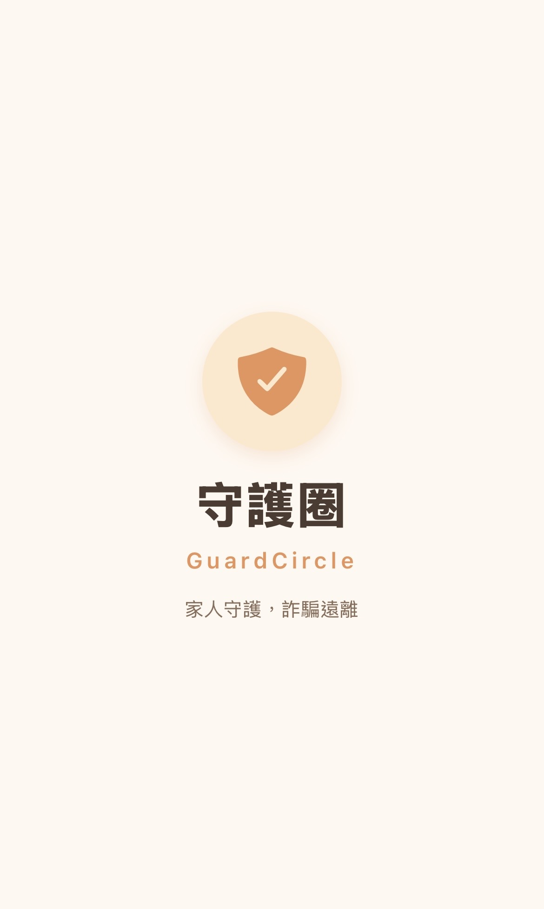
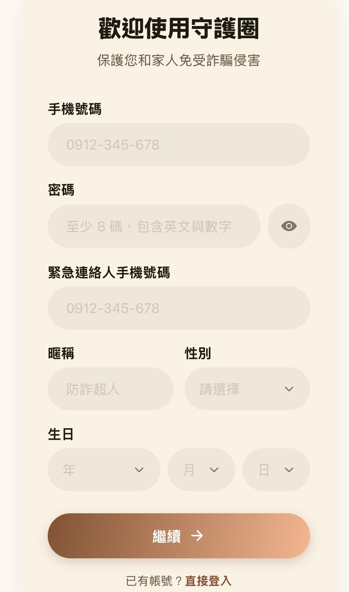
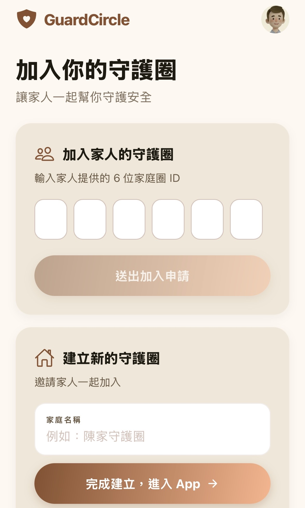
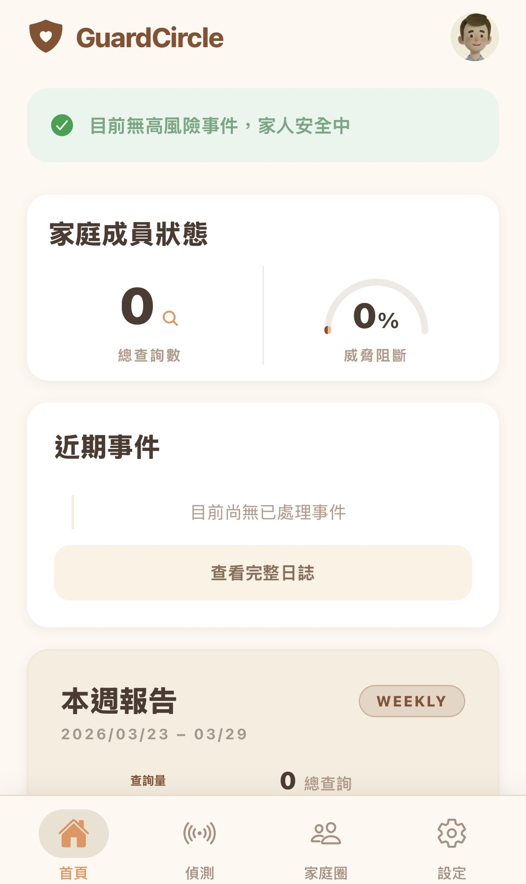
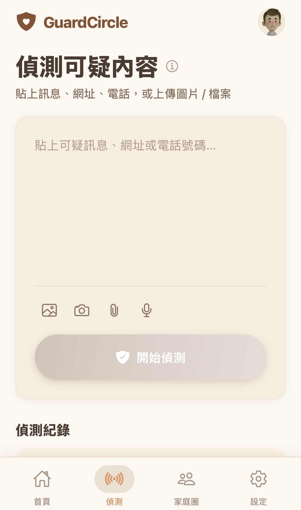
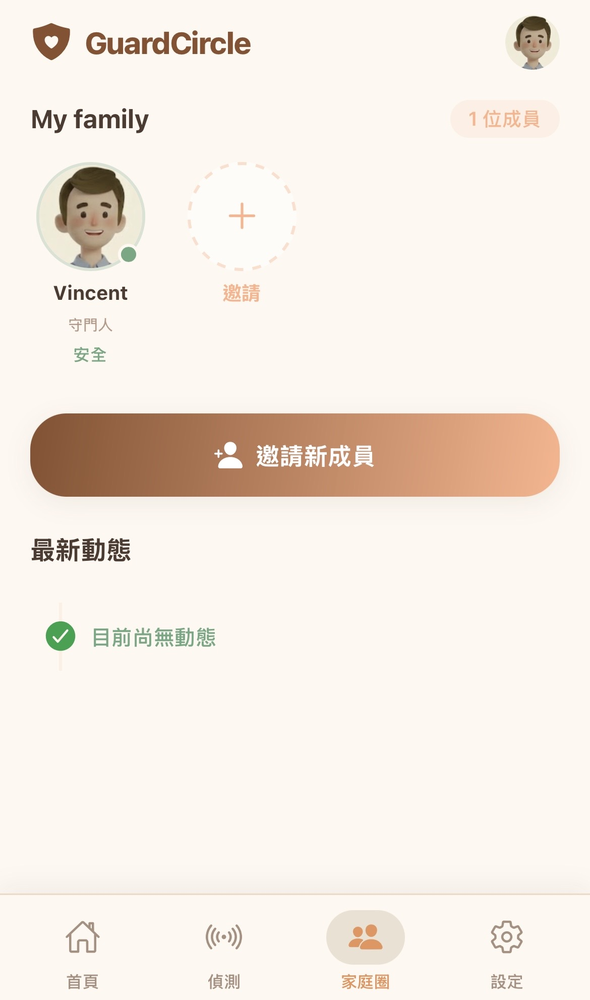

# GuardCircle App

## 系統介紹

GuardCircle 是一套家人防詐守護系統，提供：
- 內容偵測：文字、網址、電話、圖片、檔案、音訊/影片等
- 家庭圈：邀請家人、事件總覽與通知
- 風險評估：AI 分析與可解釋原因

## 系統畫面










## Repo 檔案結構

```
guardcircle-app/
├── backend/        # 後端（Terraform + Lambda）
├── frontend/       # React Native (Expo) 前端
├── img/            # 系統畫面截圖
├── scripts/        # 部署腳本
└── README.md
```
